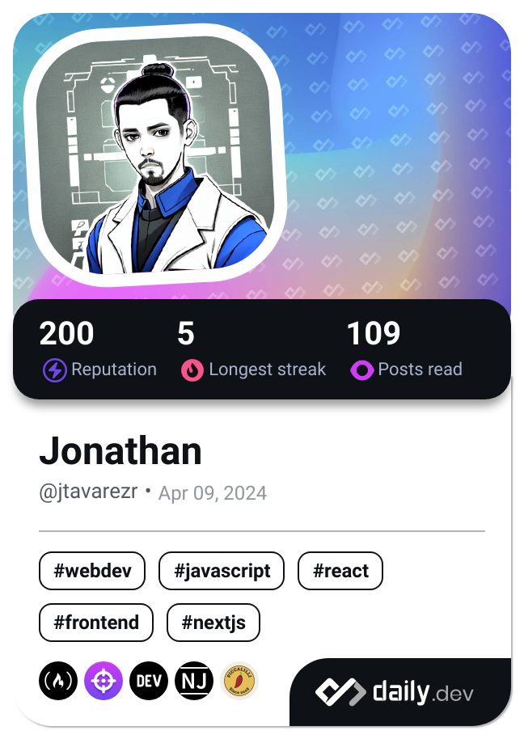

  

<h2> Hello there, I'm Jonathan </h2>

    
## 👨‍💻 About Me!
-  I am a software engineer experienced in designing and building distributed scalable systems using React, Node.js, Python, Java, C# and others. My interest lies in microservices and software architecture. I am also an active contributor to the open-source world, where I enjoy collaborating and sharing knowledge.  
My passion for problem-solving and creating efficient solutions has led me to work on various projects, where I apply my skills to develop robust and scalable software.

<!--<h1 align="center"> Hi there </h1>-->

## 🥷  Professional Skills

-  **BackEnd:**  Java, Python, Node.js (ExpressJS, NestJS)
-  **DevOps:**  Amazon Web Services (AWS), Google Cloud, Docker, Kubernetes, Jenkins, Redis
-  **FrontEnd:**  React, NextJS
-  **Database:** Relational Database (SQL, PostgreSQL) / Non-Relational Database (MongoDB, DynamoDB)

## ⭐️ Communities 

- CodePath Student
- Perschola Student
- TampaDev
- Microsoft Imaginer 
- Google Developer Student Clubs 

- 
-  
---
## 📈 Stats

<!--
### 🛠 &nbsp;Stats 

**jtavarezr/jtavarezr** is a ✨ _special_ ✨ repository because its `README.md` (this file) appears on your GitHub profile.

Here are some ideas to get you started:
👋 
- 🔭 I’m currently working on ...
- 🌱 I’m currently learning ...
- 👯 I’m looking to collaborate on ...
- 🤔 I’m looking for help with ...
- 💬 Ask me about ...
- 📫 How to reach me: ...
- 😄 Pronouns: ...
- ⚡ Fun fact: ...

- 💼 I am a software engineer with experience in developing applications using technologies such as AWS, Java, JavaScript, and TypeScript. My passion for problem-solving and creating efficient solutions has led me to work on various projects, where I apply my skills to develop robust and scalable software.

<!--- 💬 With a focus on cloud development using AWS, I have been involved in creating solid architectures that enable the efficient deployment and management of applications. My experience in languages like Java, JavaScript, and TypeScript has allowed me to work across different layers of applications, from the back-end to the front-end, ensuring a smooth and efficient user experience.

- 🌱 In addition to my technical expertise, I am enthusiastic about continuous learning and always seeking new ways to enhance my skills and stay updated with the latest technological trends. I enjoy collaborating in multidisciplinary teams, tackling challenges, and contributing to the success of innovative projects.

- 🚀 I’m looking to collaborate and continue growing as a professional and taking on new challenges in the world of software development!
-->
---

___________________________
___________________________

### 🛠 &nbsp;Languages and Tools :

&nbsp;
&nbsp;
&nbsp;
&nbsp;
&nbsp;
&nbsp;
&nbsp;
&nbsp;
&nbsp;
&nbsp;
&nbsp;
&nbsp;
&nbsp;
&nbsp;
&nbsp;
&nbsp;

---
<!--### 🔥 &nbsp; My Stats :

&nbsp;

-->
